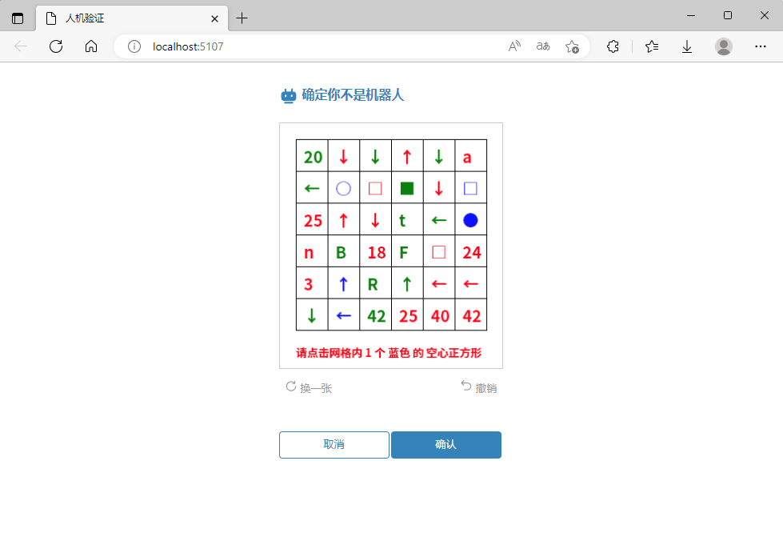
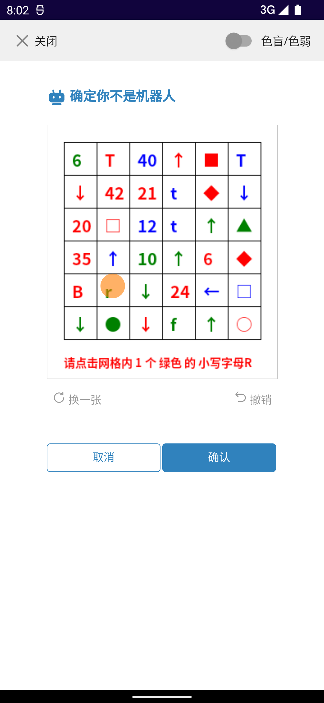
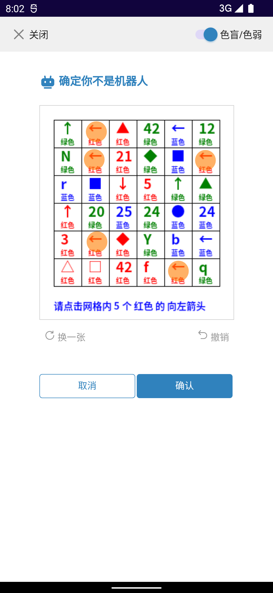

ClickableCaptcha is a clickable graphic captcha using the SkiaSharp library. This captcha generates an image with a 6x6 grid, and users need to click on the correct positions inside the image based on the prompts at the bottom.

The code structure includes the following components:

screenshot
src
ClickableCaptcha
WebDemo
screenshot is a folder to store screenshots of the actual running effect.

ClickableCaptcha is the main core library.

WebDemo is a demonstration project, and specific configurations can be found in the Program.cs file.

Screenshots
Desktop Browser



Mobile Effects




Customization
The width and height of the front end are hard-coded in the CSS based on the size of the returned image. If you need to modify the grid count or size, be sure to change the styles in the front-end CSS code.

Deployment
Currently, only the SkiaSharp package is referenced. To deploy, you need to install the corresponding SkiaSharp.NativeAssets package.

For example, on Linux:
```xml
<PackageReference Include="SkiaSharp.NativeAssets.Linux" Version="2.88.3" />
```
